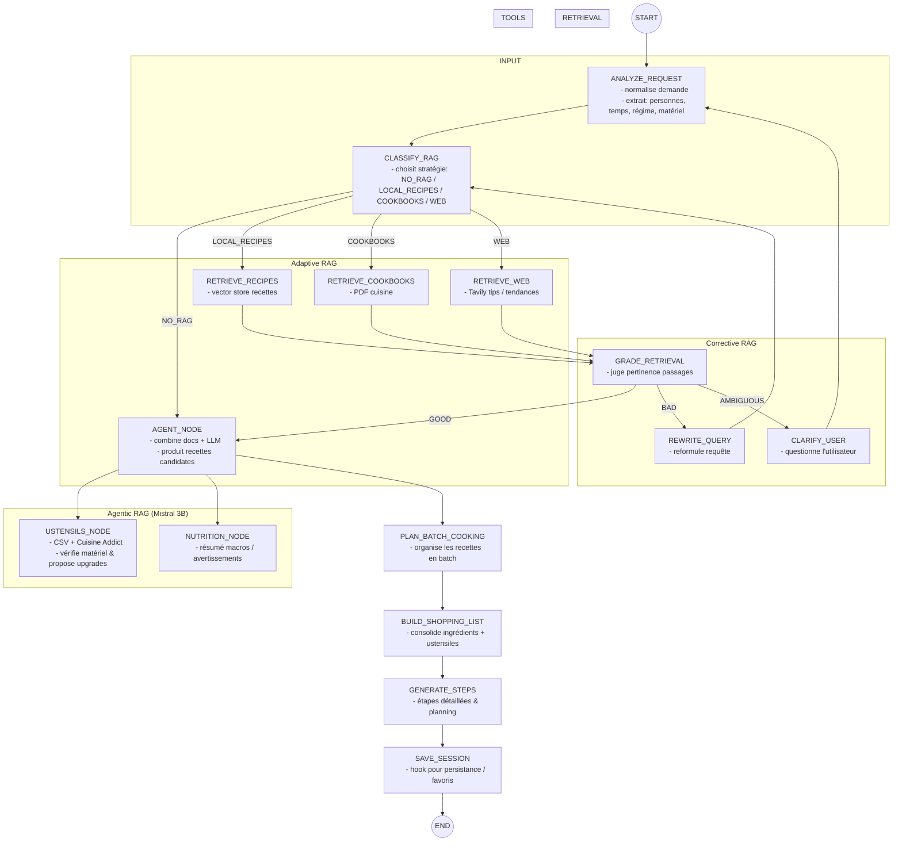

# DOC.MD

## 1. Présentation du projet

Ce projet implémente un **compagnon de recettes agentique** construit avec **LangGraph**, un **LLM Mistral 3B local via Ollama**, des **vector stores Chroma** et **Tavily** pour la recherche web.  
L’agent propose des recettes, plans de batch cooking, listes de courses et suggestions d’ustensiles en combinant plusieurs techniques modernes : **Adaptive RAG**, **Corrective RAG** et **Agentic RAG**.

Fonctionnalités principales :

- Entrée libre en langage naturel (ingrédients, contraintes, matériel, temps, régime).
- RAG multi-sources : recettes scrapées, PDFs de cuisine, catalogue d’ustensiles, web.
- Validation de la qualité des passages (Corrective RAG) et auto‑clarification.
- Agent qui choisit dynamiquement les tools (retrievers, Tavily, nutrition, ustensiles).
- Batch cooking + liste de courses consolidée.
- Exécution en mode CLI, streaming terminal et interface Streamlit.

---

## 2. Installation & dépendances (Poetry)

### 2.1. Clonage & environnement

```bash
git clone <repo>
cd langgraph-course/recipes

poetry install
```

Le projet cible Python 3.10+ (éviter 3.13 si possible, selon les libs).[13]

### 2.2. Dépendances principales

À déclarer dans `pyproject.toml` (section `[tool.poetry.dependencies]`) :

- `langchain` (OSS)
- `langgraph`
- `langchain-community`
- `langchain-chroma` – intégration Chroma moderne.[14]
- `langchain-tavily` – intégration Tavily moderne.[15]
- `sentence-transformers` – pour `all-MiniLM-L6-v2`.[16]
- `streamlit` – UI.[12]
- `rich` – `rprint` et affichage ASCII.
- `tavily-python` – SDK Tavily.[17]
- `ollama` + `langchain-community` (LLM `Ollama`).[18]

Exemple minimal :

```toml
[tool.poetry.dependencies]
python = "^3.10"

langchain = "^0.3.0"
langgraph = "^0.2.0"
langchain-community = "^0.3.0"
langchain-chroma = "^0.1.0"
langchain-tavily = "^0.1.0"

sentence-transformers = "^3.0.0"
tavily-python = "^0.3.0"

streamlit = "^1.40.0"
rich = "^13.7.0"

ollama = "^0.3.0"
dotenv = "^1.0.0"
```

### 2.3. Modèle LLM & env

Installer le modèle Mistral 3B avec Ollama :[19]

```bash
ollama pull ministral-3:3b
```

Variables d’environnement (`.env`) :

```env
MISTRAL_LOCAL_MODEL=ministral-3:3b
LLM_TEMPERATURE=0.3

EMBEDDINGS_MODEL=sentence-transformers/all-MiniLM-L6-v2

TAVILY_API_KEY=xxx
```

---

## 3. Architecture du code

### 3.1. Arborescence

```text
recipes/
  data/
    chroma/
      recipes/
      cookbooks/
      ustensils/
  pdfs/
    ...  # PDFs de cuisine
  recipes/
    __init__.py
    config.py
    database.py
    graph_builder.py
    graph_builder copy.py   # version backup
    nodes.py
    prompts.py
    schema.py
    tools.py
  main.py        # CLI / terminal
  stream.py      # UI Streamlit (streaming)
  README.MD
  DOC.MD         # ce fichier
```

### 3.2. Rôle de chaque module

- `config.py` :

  - Crée le LLM `Ollama(model="ministral-3:3b")`.
  - Initialise les embeddings `HuggingFaceEmbeddings`.
  - Ouvre les vector stores `recipes`, `cookbooks`, `ustensils` via `Chroma`.
  - Crée le tool Tavily `TavilySearch`.
  - Exporte : `LLM`, `RECIPES_VS`, `COOKBOOKS_VS`, `USTENSILS_VS`, `TAVILY_TOOL`.

- `schema.py` :

  - Définit `RecipeState` (TypedDict) avec : `query`, `normalized_request`, `rag_strategy`, `retrieved_docs`, `candidate_recipes`, `batch_plan`, `shopping_list`, `ustensils_needed`, etc.
  - Contient les constantes de nœuds (ANALYZE, CLASSIFY_RAG, RETRIEVE_RECIPES, GRADE_RETRIEVAL, AGENT, PLAN_BATCH, SHOPPING, STEPS, SAVE_STATE…).

- `prompts.py` :

  - Regroupe les prompts : analyse de demande, classification RAG, grading, réécriture, clarification, agent recettes, batch cooking, génération d’étapes.

- `tools.py` :

  - Tools LangChain :
    - `recipes_retriever` (Chroma recettes).
    - `cookbooks_retriever` (Chroma PDF).
    - `ustensils_retriever` (Chroma ustensiles / Cuisine Addict).
    - `web_search` (TavilySearch).
    - `nutrition_tool` (résumé nutrition simplifié).

- `nodes.py` :

  - Nœuds du graphe :
    - `analyze_request_node` → normalisation / extraction contraintes.
    - `classify_rag_node` → choisit `rag_strategy` (NO_RAG / LOCAL_RECIPES / COOKBOOKS / WEB).
    - `retrieve_recipes_node`, `retrieve_cookbooks_node`, `retrieve_web_node`.
    - `grade_retrieval_node`, `rewrite_query_node`, `clarify_user_node` (Corrective RAG).
    - `agent_node` → génère des recettes candidates en combinant LLM + docs.
    - `ustensils_node`, `nutrition_node`.
    - `plan_batch_cooking_node`, `build_shopping_list_node`, `generate_steps_node`, `save_session_node`.

- `graph_builder.py` :

  - Construit un `StateGraph(RecipeState)` avec tous les nœuds/edges.
  - `build_graph()` → version sync (sans checkpointer) pour CLI / Streamlit.
  - (optionnel) `build_graph_async()` → version async avec `MemorySaver` si tu veux utiliser `astream`.

- `main.py` :

  - App CLI (non streaming) qui affiche : graph ASCII, étapes de cuisson, liste de courses, ustensiles suggérés, via `rich`.

- `stream.py` :
  - App Streamlit qui utilise `graph.stream(..., stream_mode="updates")` pour afficher en temps réel : logs de nœuds, étapes, shopping list, ustensiles.

---

## 4. Workflow LangGraph (Adaptive / Corrective / Agentic RAG)

### 4.1. Vue générale

- **Input** : phrase utilisateur.
- **Analyze** : extraction « personnes, temps, régime, matériel ».
- **Adaptive RAG** : classification de la stratégie RAG.
- **Retrieval** : recipes / cookbooks / web.
- **Corrective RAG** : grade + réécriture ou clarification.
- **Agentic RAG** : agent qui combine docs + tools (recipes / ustensils / nutrition / web).
- **Batch cooking** : plan + shopping list + étapes.

### 4.2. Mermaid du workflow



---

## 5. Exécution & utilisation

### 5.1. Mode CLI (non streaming)

```bash
poetry run python main.py
```

- Affiche le graph en ASCII (`graph.get_graph().print_ascii()`).[20]
- Affiche ensuite :
  - Étapes de cuisson,
  - Liste de courses (ingrédients + ustensiles),
  - Ustensiles suggérés (avec liens si dispos).

### 5.2. Mode Streamlit (streaming par nœuds)

```bash
poetry run streamlit run recipes/stream.py
```

- Champ texte pour la demande (“J’ai poulet, carottes, 4 personnes, pas de four, 45 min”).
- À chaque nœud :
  - section de log en JSON pour debug,
  - mise à jour progressive des étapes et de la liste de courses.[11][12]

---

## 6. Prompts principaux (résumé)

Les prompts complets sont dans `prompts.py`.[13]

- **ANALYZE_REQUEST_PROMPT** : extrait `normalized_request`, `people`, `max_time_minutes`, `diet`, `allergies`, `equipment_available`.
- **CLASSIFY_RAG_PROMPT** : renvoie un token parmi `NO_RAG`, `LOCAL_RECIPES`, `COOKBOOKS`, `WEB`.
- **GRADE_RETRIEVAL_PROMPT** : évalue les docs RAG en `GOOD`, `BAD`, `AMBIGUOUS`.
- **REWRITE_QUERY_PROMPT** : réécrit la question pour un meilleur retrieval.
- **CLARIFY_USER_PROMPT** : génère une seule question de clarification.
- **AGENT_RECIPES_PROMPT** : produit 3 recettes candidates avec titre, résumé, ingrédients, temps, difficulté.
- **BATCH_COOKING_PROMPT** : construit un plan de batch cooking à partir des recettes candidates.
- **GENERATE_STEPS_PROMPT** : génère les étapes détaillées avec timings & conseils de conservation.

Ces prompts sont injectés dans `nodes.py` via `format()` sur les templates.[13]

---

## 7. Évolutions possibles

Pistes pour aller plus loin :

- Repasser sur **AsyncSqliteSaver** une fois les versions alignées pour avoir une vraie persistance multi‑session.[23][21]
- Ajouter un **profil utilisateur** (vector store ou SQLite) pour mémoriser goûts, allergies, matériel, niveau.[10][24]
- Integrer un **vrai service nutritionnel** via API (OpenFoodFacts, Edamam) dans `nutrition_tool`.[25]
- Support **images → recettes** (multi‑modal RAG) : l’utilisateur envoie une photo de plat, l’agent retrouve des recettes similaires.[26][27]

Ce document résume l’architecture, les dépendances et le workflow de ton compagnon de recettes LangGraph, tout en restant aligné avec tes patterns Devstral existants (StateGraph modulaire, RAG avancé, streaming et UI Streamlit).[28]
